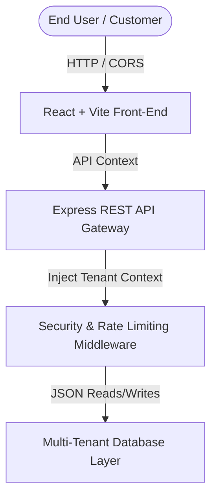

# ASTRA CRM - Enterprise Multi-Tenant SaaS CRM Platform

ASTRA CRM is a secure Software-as-a-Service (SaaS) Customer Relationship Management (CRM) platform designed to support B2B product sales lifecycles. It includes multi-tenant client onboarding, dynamic Role-Based Access Control (RBAC), an interactive Quotation & Discount Calculator, and a dedicated Customer Portal.

---

## 🏛️ System Architecture



### 1. Front-End (Vite + React)
* **Core Technologies**: React 18, Vite 8, Lucide React, Recharts.
* **Styling**: Premium glassmorphic interface utilizing variables for light/dark themes.
* **State Management**: React Context (`CRMContext`) serving as the database abstraction and auth controller wrapper.

### 2. Backend API Service (Node.js + Express)
* **API Gateway**: CORS-enabled REST endpoints mapping database entities.
* **Logical Tenant Separation**: Enforces context-level checks on every transaction to prevent cross-tenant data leaks.
* **Zero-Trust Privilege Enforcement**: Access matrix validated on incoming routes.

---

## 📁 Repository Directory Mappings

```text
LMS/
├── backend/
│   ├── db.js                # Database service layer
│   ├── db.json              # File storage database
│   ├── server.js            # Express API gateway
│   └── package.json         # Backend dependencies
├── src/
│   ├── components/
│   │   ├── auth/            # Auth forms & 2FA simulator
│   │   ├── customer/        # Customer Dashboard Portal
│   │   ├── dashboard/       # Exec analytics & charts
│   │   ├── onboarding/      # Tenant client wizard
│   │   ├── pipeline/        # Kanban board
│   │   ├── quotes/          # Quote builder & PDF preview
│   │   └── security/        # Audit logs & RBAC checklist
│   ├── context/
│   │   └── CRMContext.jsx   # Shared reactive state controller
│   ├── data/
│   │   └── mockData.js      # Baseline mock datasets
│   ├── App.jsx              # Routing & Layout wrapper
│   └── index.css            # Custom CSS & Glassmorphism variables
├── index.html               # Main entrance HTML shell
├── package.json             # Front-end configuration
└── README.md                # General developer guide
```

---

## ⚙️ Core Modules

1. **Client Tenant Onboarding**: Self-service subscription wizard allocating seat constraints, subdomain parameters, and industry compliance flags (GDPR, SOC2 Type II, ISO27001).
2. **Executive Dashboard**: Real-time sales metrics, interactive monthly revenue lines, revenue share metrics, and salesperson performance leaderboards.
3. **Smart Lead Capture**: Intake scoring matrix, source attribution, and real-time duplicate check warning banners.
4. **Interactive Pipeline Kanban**: Drag-and-drop opportunity cards reflecting dynamic win probability math and weighted sales forecasting.
5. **Product & SKU Catalog**: Interactive hardware inventory trackers displaying SKUs, variants, stock level warnings, and pricing matrices.
6. **Multi-Currency Quote Builder**: Line-item product editor, automatic VAT/GST tax calculation, volume discount thresholds, custom corporate logo upload fields, and select currency support (USD, EUR, GBP, INR, JPY).
7. **Customer Support Portal**: A separate client area allowing logged-in customers to view hardware warranty logs, check SLA tier timelines, review price estimates, and raise support tickets directly to the queue.
8. **Audit Vault & Permissions Directory**: Dynamic matrix allowing admins to alter access privileges for any role or designation. Includes an immutable activity logging trail.

---

## 🚀 Quick Start Guide

### 1. Run the SaaS Backend API
```bash
cd backend
npm install
npm start
```
*Starts Express API Gateway on `http://localhost:5000`.*

### 2. Run the Front-End Application
```bash
# In the root repository directory
npm install
npm run dev
```
*Starts front-end server at `http://localhost:5173/`.*

---

## 🔌 API Route Reference Table

| Method | Endpoint | Description | Guard / Role Access |
| :--- | :--- | :--- | :--- |
| `POST` | `/api/auth/login` | Validates credentials and initiates employee session | Public |
| `GET` | `/api/leads` | Fetches active leads scoped to tenant | `view_leads` or `view_all` |
| `POST` | `/api/leads` | Inserts new lead record into database | `edit_all` / Executive |
| `GET` | `/api/deals` | Fetches pipeline opportunities scoped to tenant | `view_all` |
| `POST` | `/api/deals` | Inserts new sales opportunity | `edit_all` |
| `GET` | `/api/quotes` | Fetches active quotes scoped to tenant | `view_all` / `create_quotes` |
| `POST` | `/api/quotes` | Saves quote metadata, logo URL, and currency selections | `create_quotes` |
| `GET` | `/api/employees` | Fetches corporate employee directories | Admin Only |
| `PUT` | `/api/employees/:id` | Modifies employee designation and roles | `security_admin` |
| `PUT` | `/api/roles/:id` | Toggles permissions list for a system role | `security_admin` |
| `GET` | `/api/audit-logs` | Fetches immutable security event trails | Admin Only |

---

## 🛡️ Production Readiness Checklist

### 1. Cross-Origin Resource Sharing (CORS)
Ensure that `cors()` configuration in production is restricted only to your front-end domain:
```javascript
app.use(cors({
  origin: process.env.FRONTEND_URL || 'https://astracrm.io',
  credentials: true
}));
```

### 2. Database Transactions
When migrating the local JSON storage layer to PostgreSQL in production, enforce ACID-compliant transactions using Prisma ORM when creating dependent records (e.g. converting a quote to an order):
```javascript
const transactionResult = await prisma.$transaction(async (tx) => {
  const updatedQuote = await tx.quote.update({ ... });
  const createdOrder = await tx.order.create({ ... });
  return { updatedQuote, createdOrder };
});
```

### 3. Rate-Limiting & Security Headers [INTEGRATED]
We have integrated production-ready security layers directly into `backend/server.js`:
* **Helmet Security Headers**: Active on all Express response channels to block scripting injections and referrer leaks.
* **Express Rate Limiter**: Enabled to restrict general endpoint loads to 150 requests per 15-minute window per IP.
* **Login Brute-Force Shield**: Enforces a strict cap of 10 login requests per 5 minutes to prevent automated dictionary attacks.

### 4. Data Scoping Isolation Edge-Cases
To prevent horizontal privilege escalations, ensure all data mutating controllers filter queries strictly by the authenticated session tenant:
```javascript
const tenantId = req.user.tenantId;
const targetRecord = await prisma.lead.findFirst({
  where: { id: req.params.id, tenantId } // Scoped
});
if (!targetRecord) return res.status(404).json({ error: "Record not found." });
```
